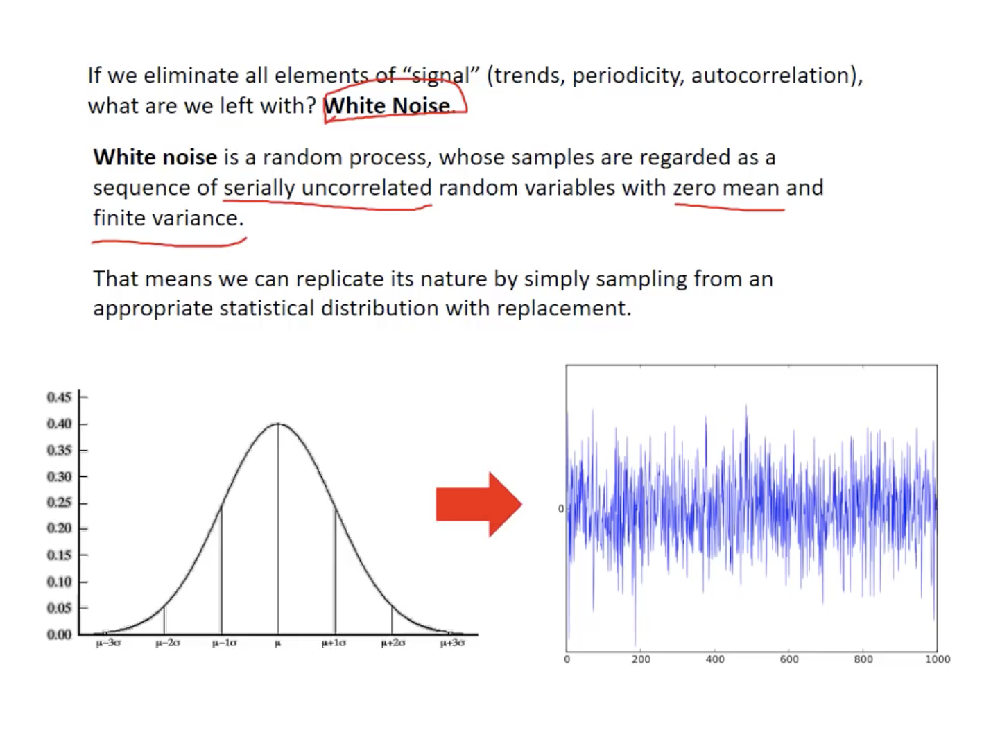

# Lecture 13: Time Series Analysis #
Notes from Jordan Kern's <a href = "https://www.youtube.com/watch?v=Prpu_U5tKkE" target = "_blank">Lecture 13</a> video.

Definition of Time Series: An _ordered_ sequence of values of a variable at equally spaced time intervals.

## Time Series has _some things_ in common with probability & regression ##

- Mean & Standard Deviation
  - The mean and/or variance (standard deviations) change through time series processes despite the parts being described, in many cases, through randomized variable with statistical moments.
  
If you sampled/pulled from a time series distribution, would you be able to plot out the data points in a similar fashion to the image on the left, below:

 

The answer is **no**
- If the value of x(t) depends in any significant way on the value of x(t-1).
  - These a hints of what's called "memory" in a time series. 
- Trends tend to persist in a time series, but overall there is no trend.
  - Another words for this is **autocorrelation**
  
- Regression
  - time series analysis is focused on identifying underlying trends and patterns, describing them mathematically, and ultimtely making a prediction or forecast about what will happen next.
  - But where regression aims to quantify the specific impacts of of specific underlying independent variables (Y = b1x1 + b2x2 + b3x3 ...), time series modeling allows for the replication of every element in the process by combining them into **signals** (e.g. year-on-year growth in electrivity demand, etc.) and **noise** (random probabilistic processes) which adds some level of uncertainty.

|  |
| :-: |
| In the bottom plot, you see some indication of a trend/signal, but with the added noise or uncertainty around it. |
  
Common terms describing the nature of both signal **and** noise of a time series process:

- Statistical moments
  - Mean & Standard Deviation
- Stationary vs. non-stationary
  - Trends in mean and/or standard deviation (whether things change over time)
- Seasonality
  - Periodic patterns
- Autocorrelation
  - Degree to which time series values in period (t) are related to time series values in periods (t+1, t+2, ...)
  
## Pre-processing & Filtering ##

A big part of time series analysis involves filtering (changing attributes of a time series or deconstructing it into its component parts). Often, you'll do quite a bit of time-series before building a model to simulate the underlying process.

Filters tha can be applied to time series data:
- Detrending 
  - Non-stationarity (accounting for a change in mean over time)
  - Seasonality (things changing on a cyclic nature/periodic trends)
- Autocorrelation (memory in the system)
- Outliers (trying to et rid of all the signal and leave behind the noise)
- 'Low Pass' filters
  - Smoothing (getting rid of the noise inthe system and only allowing big changes to be seen in the system)
    - Moving average
	- Exponential

### Non-stationarity ###

|  |
| :-: |
| The standard deviation nor the seasonality is changing just the mean (on an upward trend) |
| :-: |
|  |
| :-: |
| Given a constant and time, we can estimate what the concetrations of CO2 may be. Given that model, we can subtract what the CO2 concentration is and we're left with a detrended CO2 data. Detrended in the sense of year to year. There's still a seasonality trend here, but the mean is centered around zero.  It's clearly not white noise. The mean, centered around 0, can have it's residuals described around a probaility distribution but, there's autocorrelation. The value of CO2 concentration from one month to the next is very closely related to one another. |

### Differencing ###

If the series has a long-runnign trend and tends to revert to the trend line following a distrubance, it be possible to stationarize it by de-trending (e.g. by fitting a trend line and subtracting it out prior to fitting a model). Such a series is said to be **trend-stationary**.

However, sometimes even de-trending is not sufficient to make the series stationary. In this scenario, it may ne necessary to transform it into a series of period-to-period and/or season-to-season **differences**.

If the mean, variance and autocorrelations of the original series are not constant in time, even after detrending, perhaps statistics of the _changes_ in the series between periods or between seasons _will_ be constant. Such a series is said to be ** difference-stationary**.

|  |
| :-: |
| The points in the right plot are the differences between two consecutive days of the left plot. What we get is that the mean is roughly 0 and has less nonstationarity. The variance or standard deviation for the right plot is not stationary though. |

If the first difference of Y is stationary and also _completely random_ (not autocorrelated), then Y is described by a **random walk model**: each value is a random step away from the previous value. 

|  |
| :-: |
| We all start at 0 but each individual simulation, which is a different color, the evolution of the W value is a random value. There's memory in the system. The value that we get today is directly dependent on the value we got yesterday, but how we got from yesterday to today's value is a random value. |

### Seasonality ###

If seasonality (periodic fluctuations) is present, it must be incorporated into a time series model. **How do we detect it?**

- One of the simplest ways is using box plots.

|  |
| :-: |
| Here, we're starting with residuals, centered around 0, and trying to remove the seasonality and understand how CO2 concentrations change over time if we take out year-to-year trends.  In the bottom, what we have is something that looks like a random walk. It kind of looks like white noise but there's some memory left in the system (values stay above 0 for a while, then below 0 for a while), therefore it can't be replicated by sampling random values and doesn't represent a random process. |

### Autocorrelation ###

One of the fundamental differences between many time series and a random sampling from a single, known distribution, is that time series often have 'memory' i.e. values in one time period influence values in subsequent time periods.

We quantify this memory as **autocorrelation**

The autocorrelation function can be used for the following two purposes:
- To detect non-randomness in data
- To identify an appropriate time series model if the data are not random

|  |
| :-: |
| The formula for correlation between random values in a distribution and autocorrelation is very similar, except it's looking at the values in different time-shifts. Here you're taking the sum of Y, at time period i, minus the mean of Y, times the value of Y, at time period i plus k minus the mean of Y... then dividing by Yi minus the mean of Y, squared. |

If we have a strong correlation between every 10 time periods, then that gives us _periodicity_ or when certain values will happen again or about the same.

Autocorrelation can be tested at as many lags as we want, depending on the length of the time series. 
- Then we can plot autocorrelation as a function of lag. This tests how much memory, or correlation is exhibited between different points, changes over how far apart they are, in time. 
- If you get far enough away from each other, in terms of correlation, you can start to consider those values as independent from each other.

### White Noise ###

|  |
| :-: |
| Once rid of all signal, what you have left is a sort of random variable, like the bottom left, and you can directly sample from it and plot the eftover time series process (bottom right) |

 